# Diplom
https://github.com/netology-code/devops-diplom-yandexcloud/blob/main/README.md

# Дипломный практикум в Yandex.Cloud
  * [Цели:](#цели)
  * [Этапы выполнения:](#этапы-выполнения)
     * [Создание облачной инфраструктуры](#создание-облачной-инфраструктуры)
     * [Создание Kubernetes кластера](#создание-kubernetes-кластера)
     * [Создание тестового приложения](#создание-тестового-приложения)
     * [Подготовка cистемы мониторинга и деплой приложения](#подготовка-cистемы-мониторинга-и-деплой-приложения)
     * [Установка и настройка CI/CD](#установка-и-настройка-cicd)
  * [Что необходимо для сдачи задания?](#что-необходимо-для-сдачи-задания)
  * [Как правильно задавать вопросы дипломному руководителю?](#как-правильно-задавать-вопросы-дипломному-руководителю)

**Перед началом работы над дипломным заданием изучите [Инструкция по экономии облачных ресурсов](https://github.com/netology-code/devops-materials/blob/master/cloudwork.MD).**

---
## Цели:

1. Подготовить облачную инфраструктуру на базе облачного провайдера Яндекс.Облако.
2. Запустить и сконфигурировать Kubernetes кластер.
3. Установить и настроить систему мониторинга.
4. Настроить и автоматизировать сборку тестового приложения с использованием Docker-контейнеров.
5. Настроить CI для автоматической сборки и тестирования.
6. Настроить CD для автоматического развёртывания приложения.

---
## Этапы выполнения:

### Создание облачной инфраструктуры

Для начала необходимо подготовить облачную инфраструктуру в ЯО при помощи [Terraform](https://www.terraform.io/).

Особенности выполнения:

- Бюджет купона ограничен, что следует иметь в виду при проектировании инфраструктуры и использовании ресурсов;
Для облачного k8s используйте региональный мастер(неотказоустойчивый). Для self-hosted k8s минимизируйте ресурсы ВМ и долю ЦПУ. В обоих вариантах используйте прерываемые ВМ для worker nodes.

Предварительная подготовка к установке и запуску Kubernetes кластера.

1. Создайте сервисный аккаунт, который будет в дальнейшем использоваться Terraform для работы с инфраструктурой с необходимыми и достаточными правами. Не стоит использовать права суперпользователя
2. Подготовьте [backend](https://developer.hashicorp.com/terraform/language/backend) для Terraform:  
   а. Рекомендуемый вариант: S3 bucket в созданном ЯО аккаунте(создание бакета через TF)
   б. Альтернативный вариант:  [Terraform Cloud](https://app.terraform.io/)
3. Создайте конфигурацию Terrafrom, используя созданный бакет ранее как бекенд для хранения стейт файла. Конфигурации Terraform для создания сервисного аккаунта и бакета и основной инфраструктуры следует сохранить в разных папках.
4. Создайте VPC с подсетями в разных зонах доступности.
5. Убедитесь, что теперь вы можете выполнить команды `terraform destroy` и `terraform apply` без дополнительных ручных действий.
6. В случае использования [Terraform Cloud](https://app.terraform.io/) в качестве [backend](https://developer.hashicorp.com/terraform/language/backend) убедитесь, что применение изменений успешно проходит, используя web-интерфейс Terraform cloud.

Ожидаемые результаты:

1. Terraform сконфигурирован и создание инфраструктуры посредством Terraform возможно без дополнительных ручных действий, стейт основной конфигурации сохраняется в бакете или Terraform Cloud
2. Полученная конфигурация инфраструктуры является предварительной, поэтому в ходе дальнейшего выполнения задания возможны изменения.

---
### Создание Kubernetes кластера

На этом этапе необходимо создать [Kubernetes](https://kubernetes.io/ru/docs/concepts/overview/what-is-kubernetes/) кластер на базе предварительно созданной инфраструктуры.   Требуется обеспечить доступ к ресурсам из Интернета.

Это можно сделать двумя способами:

1. Рекомендуемый вариант: самостоятельная установка Kubernetes кластера.  
   а. При помощи Terraform подготовить как минимум 3 виртуальных машины Compute Cloud для создания Kubernetes-кластера. Тип виртуальной машины следует выбрать самостоятельно с учётом требовании к производительности и стоимости. Если в дальнейшем поймете, что необходимо сменить тип инстанса, используйте Terraform для внесения изменений.  
   б. Подготовить [ansible](https://www.ansible.com/) конфигурации, можно воспользоваться, например [Kubespray](https://kubernetes.io/docs/setup/production-environment/tools/kubespray/)  
   в. Задеплоить Kubernetes на подготовленные ранее инстансы, в случае нехватки каких-либо ресурсов вы всегда можете создать их при помощи Terraform.
2. Альтернативный вариант: воспользуйтесь сервисом [Yandex Managed Service for Kubernetes](https://cloud.yandex.ru/services/managed-kubernetes)  
  а. С помощью terraform resource для [kubernetes](https://registry.terraform.io/providers/yandex-cloud/yandex/latest/docs/resources/kubernetes_cluster) создать **региональный** мастер kubernetes с размещением нод в разных 3 подсетях      
  б. С помощью terraform resource для [kubernetes node group](https://registry.terraform.io/providers/yandex-cloud/yandex/latest/docs/resources/kubernetes_node_group)
  
Ожидаемый результат:

1. Работоспособный Kubernetes кластер.
2. В файле `~/.kube/config` находятся данные для доступа к кластеру.
3. Команда `kubectl get pods --all-namespaces` отрабатывает без ошибок.

---
### Создание тестового приложения

Для перехода к следующему этапу необходимо подготовить тестовое приложение, эмулирующее основное приложение разрабатываемое вашей компанией.

Способ подготовки:

1. Рекомендуемый вариант:  
   а. Создайте отдельный git репозиторий с простым nginx конфигом, который будет отдавать статические данные.  
   б. Подготовьте Dockerfile для создания образа приложения.  
2. Альтернативный вариант:  
   а. Используйте любой другой код, главное, чтобы был самостоятельно создан Dockerfile.

Ожидаемый результат:

1. Git репозиторий с тестовым приложением и Dockerfile.
2. Регистри с собранным docker image. В качестве регистри может быть DockerHub или [Yandex Container Registry](https://cloud.yandex.ru/services/container-registry), созданный также с помощью terraform.

---
### Подготовка cистемы мониторинга и деплой приложения

Уже должны быть готовы конфигурации для автоматического создания облачной инфраструктуры и поднятия Kubernetes кластера.  
Теперь необходимо подготовить конфигурационные файлы для настройки нашего Kubernetes кластера.

Цель:
1. Задеплоить в кластер [prometheus](https://prometheus.io/), [grafana](https://grafana.com/), [alertmanager](https://github.com/prometheus/alertmanager), [экспортер](https://github.com/prometheus/node_exporter) основных метрик Kubernetes.
2. Задеплоить тестовое приложение, например, [nginx](https://www.nginx.com/) сервер отдающий статическую страницу.

Способ выполнения:
1. Воспользоваться пакетом [kube-prometheus](https://github.com/prometheus-operator/kube-prometheus), который уже включает в себя [Kubernetes оператор](https://operatorhub.io/) для [grafana](https://grafana.com/), [prometheus](https://prometheus.io/), [alertmanager](https://github.com/prometheus/alertmanager) и [node_exporter](https://github.com/prometheus/node_exporter). Альтернативный вариант - использовать набор helm чартов от [bitnami](https://github.com/bitnami/charts/tree/main/bitnami).

### Деплой инфраструктуры в terraform pipeline

1. Если на первом этапе вы не воспользовались [Terraform Cloud](https://app.terraform.io/), то задеплойте и настройте в кластере [atlantis](https://www.runatlantis.io/) для отслеживания изменений инфраструктуры. Альтернативный вариант 3 задания: вместо Terraform Cloud или atlantis настройте на автоматический запуск и применение конфигурации terraform из вашего git-репозитория в выбранной вами CI-CD системе при любом комите в main ветку. Предоставьте скриншоты работы пайплайна из CI/CD системы.

Ожидаемый результат:
1. Git репозиторий с конфигурационными файлами для настройки Kubernetes.
2. Http доступ на 80 порту к web интерфейсу grafana.
3. Дашборды в grafana отображающие состояние Kubernetes кластера.
4. Http доступ на 80 порту к тестовому приложению.
5. Atlantis или terraform cloud или ci/cd-terraform
---
### Установка и настройка CI/CD

Осталось настроить ci/cd систему для автоматической сборки docker image и деплоя приложения при изменении кода.

Цель:

1. Автоматическая сборка docker образа при коммите в репозиторий с тестовым приложением.
2. Автоматический деплой нового docker образа.

Можно использовать [teamcity](https://www.jetbrains.com/ru-ru/teamcity/), [jenkins](https://www.jenkins.io/), [GitLab CI](https://about.gitlab.com/stages-devops-lifecycle/continuous-integration/) или GitHub Actions.

Ожидаемый результат:

1. Интерфейс ci/cd сервиса доступен по http.
2. При любом коммите в репозиторие с тестовым приложением происходит сборка и отправка в регистр Docker образа.
3. При создании тега (например, v1.0.0) происходит сборка и отправка с соответствующим label в регистри, а также деплой соответствующего Docker образа в кластер Kubernetes.

---
## Что необходимо для сдачи задания?

1. Репозиторий с конфигурационными файлами Terraform и готовность продемонстрировать создание всех ресурсов с нуля.
2. Пример pull request с комментариями созданными atlantis'ом или снимки экрана из Terraform Cloud или вашего CI-CD-terraform pipeline.
3. Репозиторий с конфигурацией ansible, если был выбран способ создания Kubernetes кластера при помощи ansible.
4. Репозиторий с Dockerfile тестового приложения и ссылка на собранный docker image.
5. Репозиторий с конфигурацией Kubernetes кластера.
6. Ссылка на тестовое приложение и веб интерфейс Grafana с данными доступа.
7. Все репозитории рекомендуется хранить на одном ресурсе (github, gitlab)

_______________________
### Решение

Создание облачной инфраструктуры

1. Создаем сервисный акк и бакенд

- Мы добавляем токен Яндекса в переменные окружения, чтобы система могла безопасно использовать его для доступа к облачным ресурсам.
После этого выполняем проверку, чтобы убедиться, что токен работает корректно и доступ к сервисам действительно будет предоставлен.

- Мы инициализируем проект, чтобы подготовить его к работе и настроить все необходимые связи.
Затем проверяем правильность конфигурации и убеждаемся, что в настройках нет ошибок.
После этого смотрим планирование изменений, чтобы заранее понять, какие действия будут выполнены и какой результат они дадут.

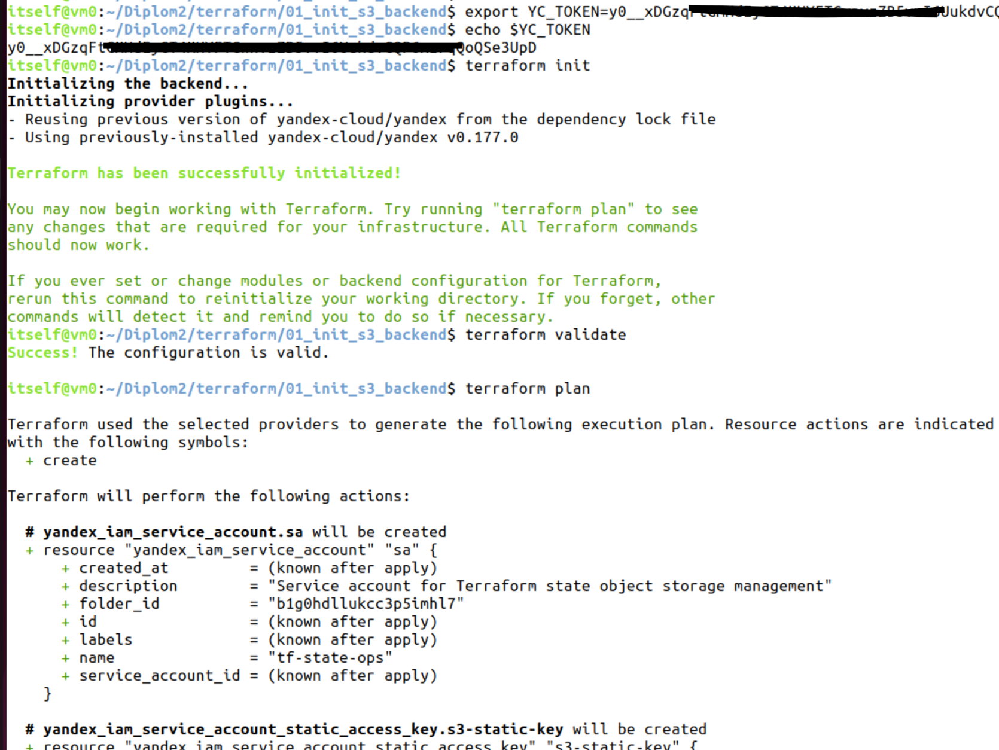

- Мы выполняем все запланированные действия, чтобы изменения были применены на практике.
После выполнения убеждаемся, что процесс прошёл успешно и результат соответствует ожиданиям.

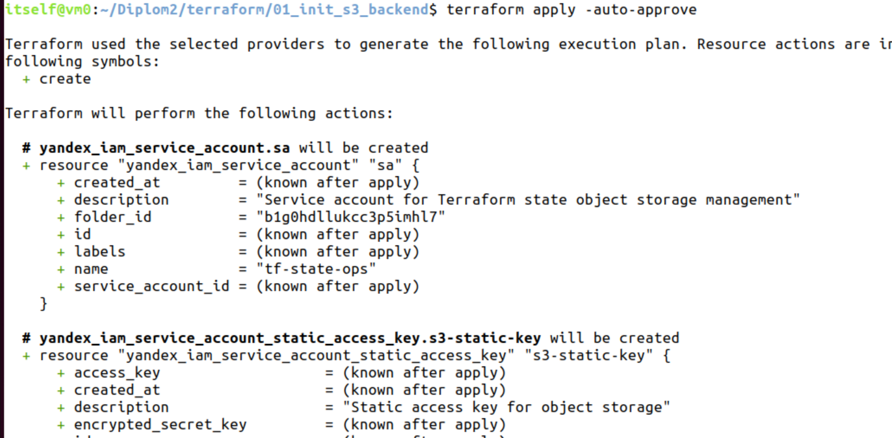

- В результате все действия выполняются корректно и без каких-либо ошибок.
Это подтверждает, что настройки выполнены правильно и система работает так, как было запланировано.

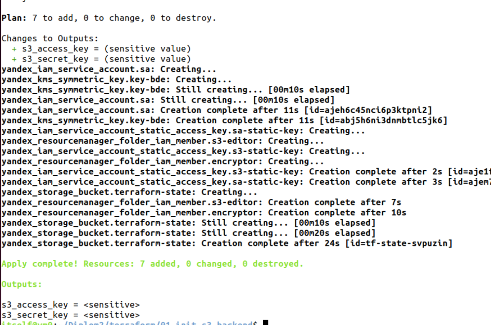

- Мы добавляем secret key и access key прямо в скрипт, чтобы система могла пройти авторизацию и получить доступ к нужным ресурсам.
После этого запускаем скрипт и смотрим, выполняются ли операции без ошибок — это подтверждает, что ключи указаны верно и работают.
Если доступ получен успешно, значит настройки выполнены правильно и можно продолжать дальнейшую работу.

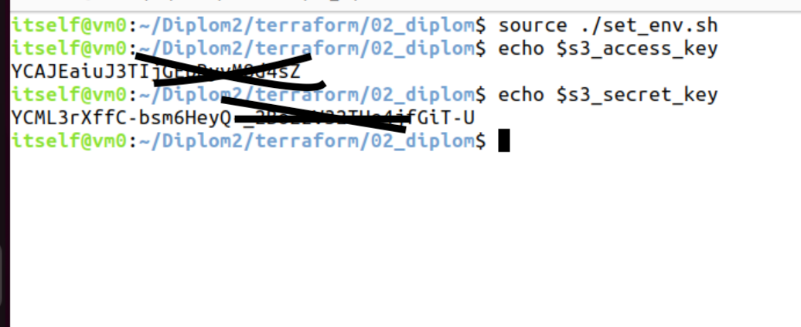

- Мы создаём новое окружение, чтобы отделить дальнейшую работу от предыдущих настроек и изменений.
После создания переходим в него и делаем его активным, чтобы все последующие действия выполнялись именно в этом окружении.

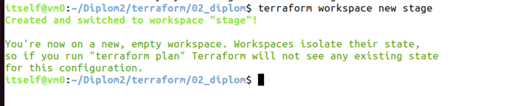

- Мы создаём виртуальную сеть (VPC) и настраиваем в ней подсети, размещая их в разных зонах доступа для надёжности и отказоустойчивости.
Затем инициализируем окружение, чтобы система подготовилась к работе и проверила доступы.
После этого выполняем планирование, чтобы заранее увидеть, какие ресурсы будут созданы и убедиться, что всё настроено правильно.

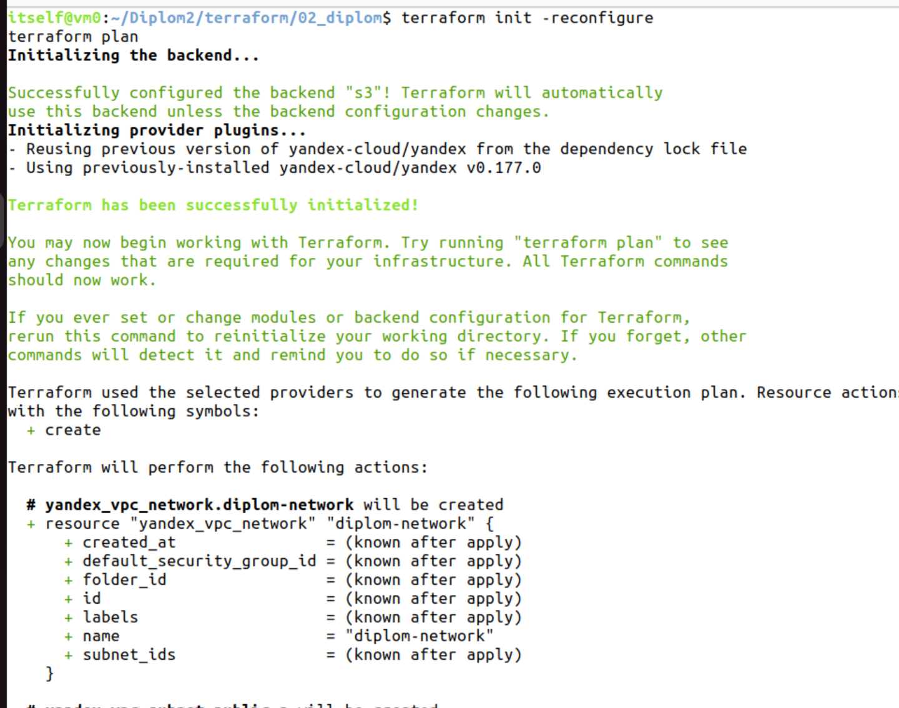

- Мы выполняем запланированные действия, чтобы все ресурсы были реально созданы в облаке.
После выполнения проверяем результат и убеждаемся, что инфраструктура работает корректно и все компоненты созданы как задумано.

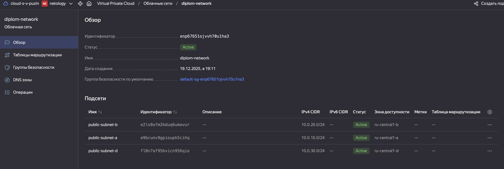

- Мы начинаем процесс создания Kubernetes-кластера, чтобы подготовить среду для развертывания приложений.
На этом этапе настраиваются основные компоненты кластера и выделяются ресурсы для его работы.
Цель — получить готовую инфраструктуру, в которой можно безопасно управлять контейнерами и сервисами.

- Все прошло успешно: кластер создан и работает корректно.
Это означает, что настройки выполнены правильно и среда готова к дальнейшему использованию.

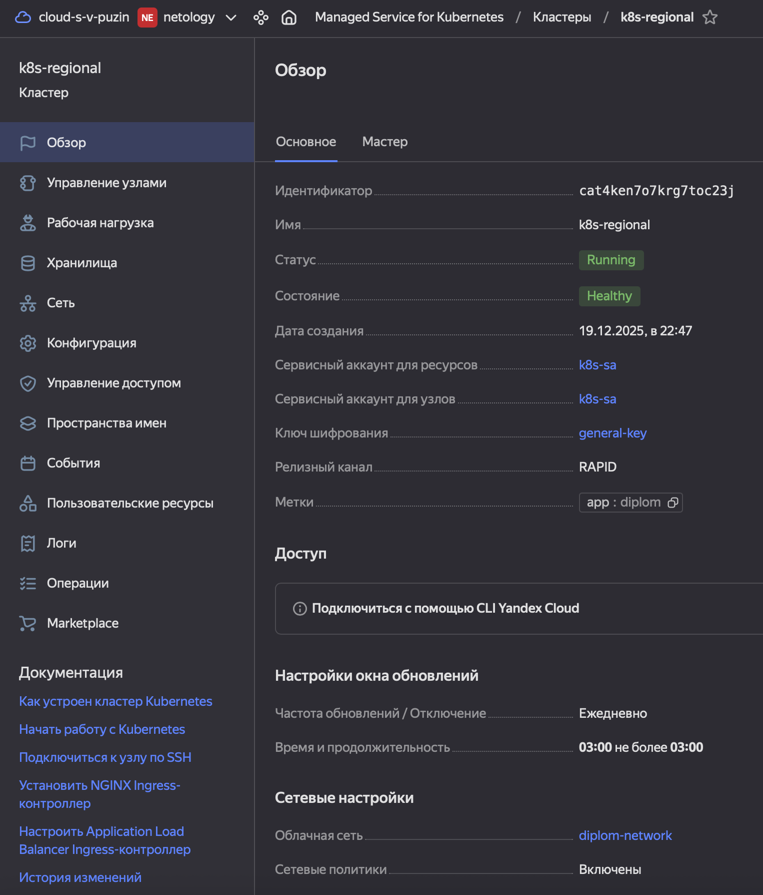

- Ошибок при создании кластера не возникло, всё сработало корректно.
Это подтверждает, что процесс прошёл гладко и система полностью готова к работе.

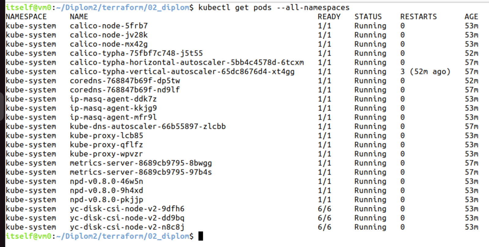

- Создание тестового приложения

- Контейнерный регистр настроен и готов к использованию.
Это значит, что теперь можно безопасно загружать и хранить образы контейнеров для дальнейшего развертывания приложений.

- Создан отдельный репозиторий для проекта, чтобы хранить код и конфигурации отдельно и удобно управлять ими.
Это позволяет вести изменения безопасно и отслеживать все версии работы над проектом.

https://github.com/svpuzin/diplom_app
https://svpuzin.gitlab.yandexcloud.net/s.v.puzin/diplom_app

- Подготовлен и создан образ приложения

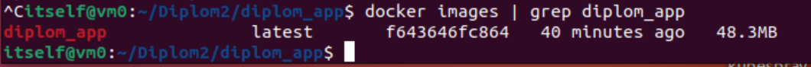

- Образ приложения загружен в Container Registry

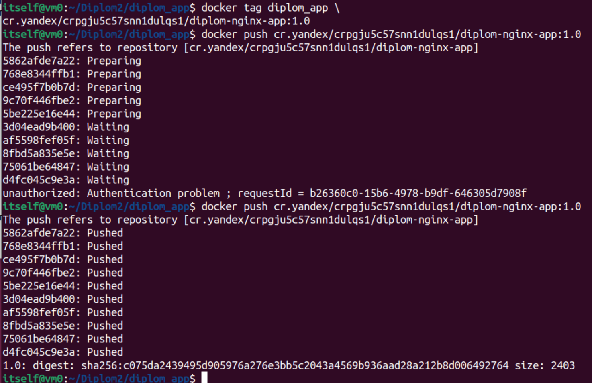

- Проверяем в вебе

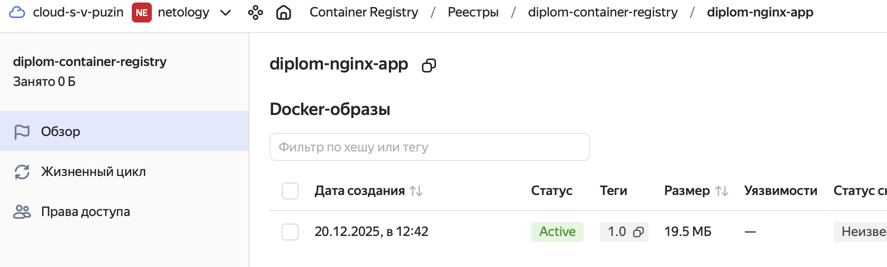

- Подготовка cистемы мониторинга

- Клонировал репозиторий https://github.com/prometheus-operator/kube-prometheus и установил

- проверил

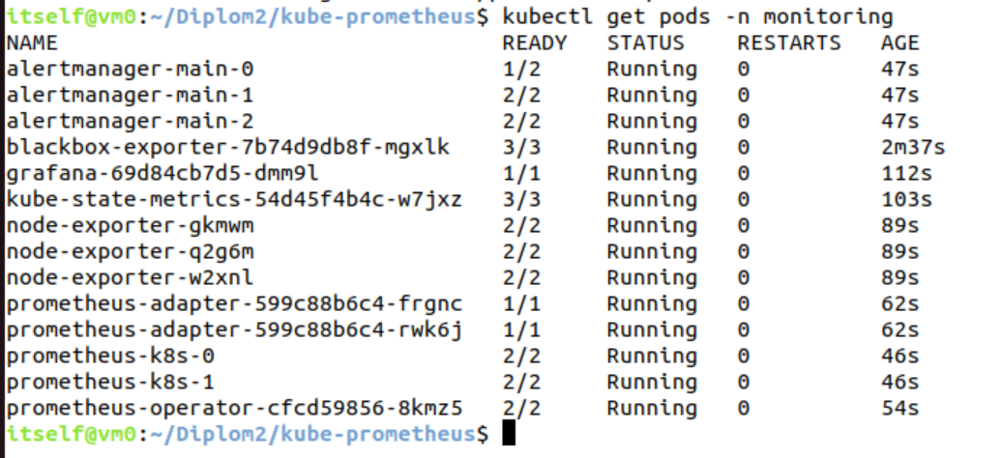

- Пробрасываем порт, чтобы получить доступ к Prometheus из внешней среды.
После этого проверяем работу Prometheus, убеждаясь, что сервис доступен и корректно собирает метрики.

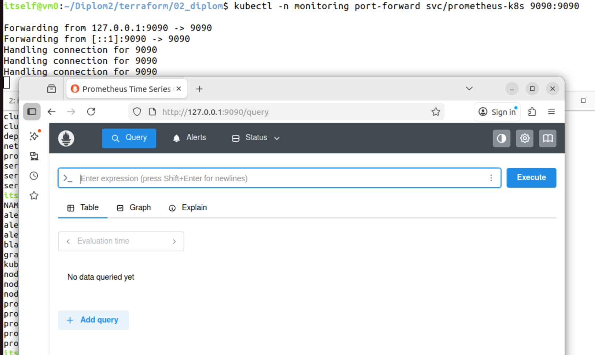

- Пробрасываем порт, чтобы открыть доступ к Grafana из внешней среды.
Затем проверяем, что Grafana работает корректно и отображает нужные дашборды и метрики.

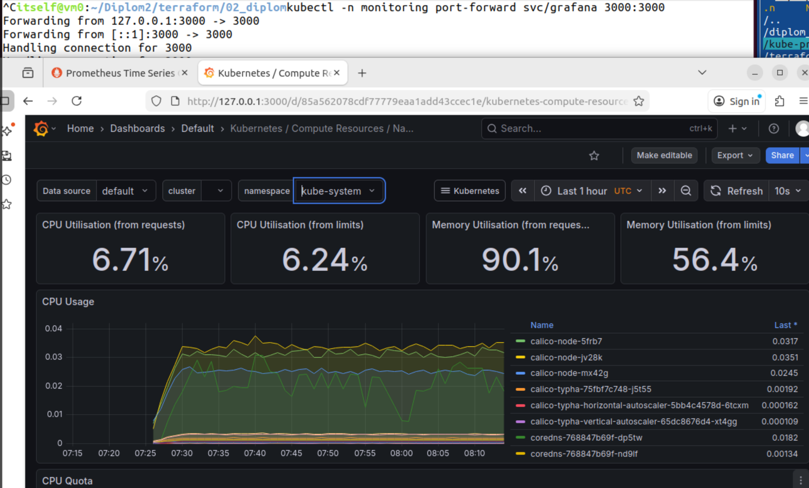

- Вход на графану снаружи сделал по 30080 порту лог/пасс admin/admin http://89.169.142.59:30080/d/85a562078cdf77779eaa1add43ccec1e/kubernetes-compute-resources-namespace-pods?orgId=1&from=now-1h&to=now&timezone=UTC&var-datasource=P1809F7CD0C75ACF3&var-cluster=&var-namespace=kube-system&refresh=10s

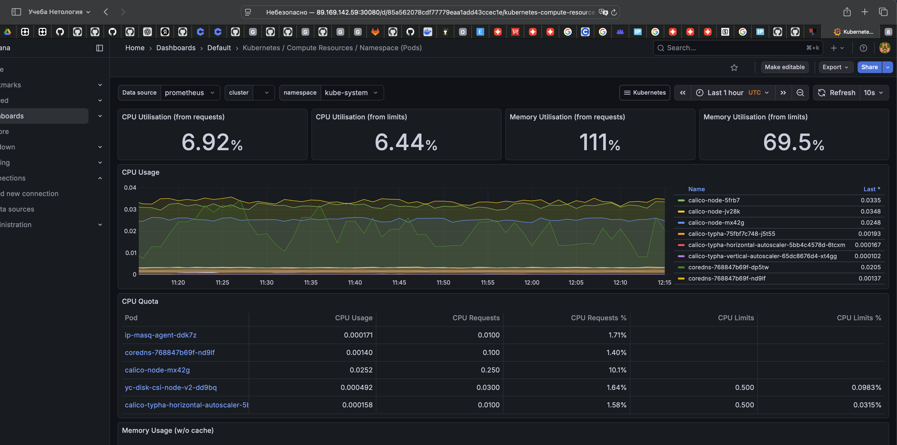

- Деплой тестового приложения

- Устанавливаю и настраиваю Qbec для работы с Kubernetes.
После настройки проверяю, что инструмент работает корректно и готов к управлению конфигурациями кластера.
Результат подтверждает, что установка и настройка прошли успешно.

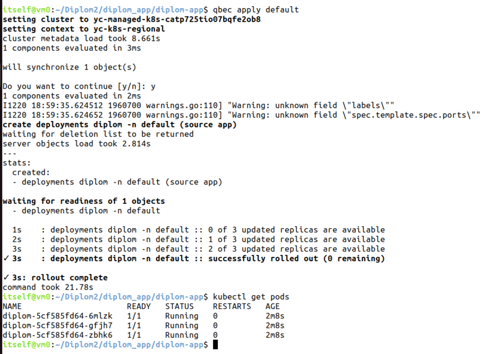

- Установил балансировщик нагрузки для приложения, чтобы распределять трафик между его экземплярами.
После настройки получил внешний адрес, по которому можно обращаться к приложению из интернета.
Это подтверждает, что приложение доступно извне и готово к использованию.

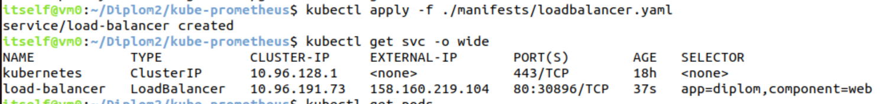

- Проверяем работу приложения через интернет, используя полученный внешний адрес.
Это позволяет убедиться, что приложение доступно пользователям и функционирует корректно в реальной среде.

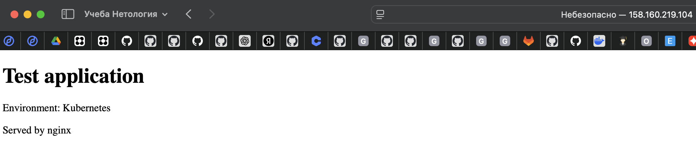

- Деплой инфраструктуры в terraform pipeline

- Устанавливаю Atlantis в кластер согласно инструкции, чтобы автоматизировать управление Terraform-проектами.
После установки проверяю работу сервиса, чтобы убедиться, что он корректно интегрирован и готов к использованию.

- Atlantis успешно запущен, и веб-интерфейс доступен для работы.
Это означает, что сервис корректно развернут в кластере и готов к управлению Terraform-проектами через браузер.

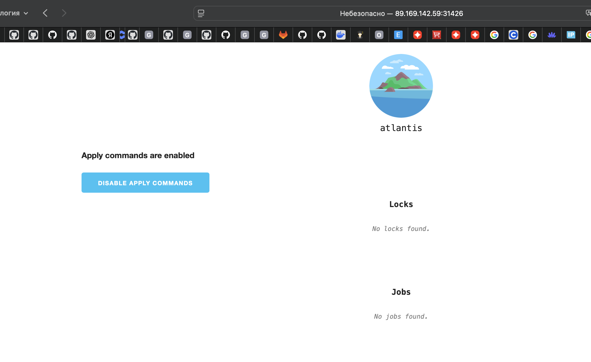

- Настраиваю вебхук на GitHub, чтобы автоматически отправлять события в Atlantis при изменениях в репозитории.
Это позволяет сервису получать уведомления о коммитах и pull request’ах и автоматически запускать процессы Terraform.

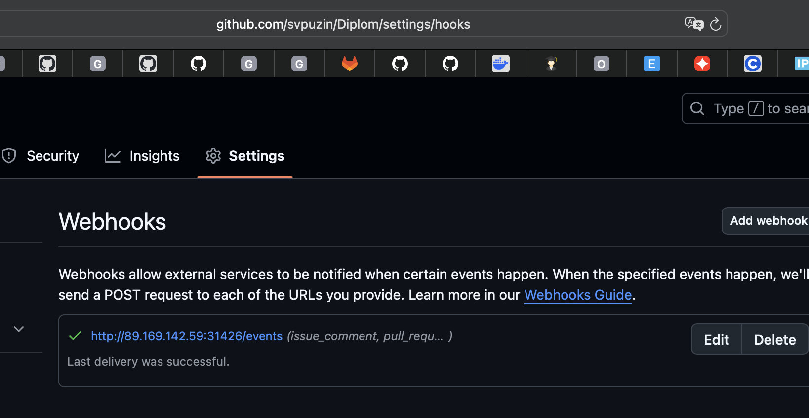

- а вот тут затык пока ((( атлантис отрабатывает но не планит пока вроде как жалуется на то что атлантис из кубера не видит инет и гитхаб

- Установка и настройка CI/CD

- Создан GitLab-сервер для хранения репозиториев и управления проектами.
Это позволяет централизованно вести код, отслеживать изменения и настраивать CI/CD процессы.

- Устанавливаю GitLab Runner, чтобы выполнять задачи CI/CD для проектов на GitLab.
После установки проверяем его, чтобы убедиться, что Runner корректно подключён и готов запускать пайплайны.

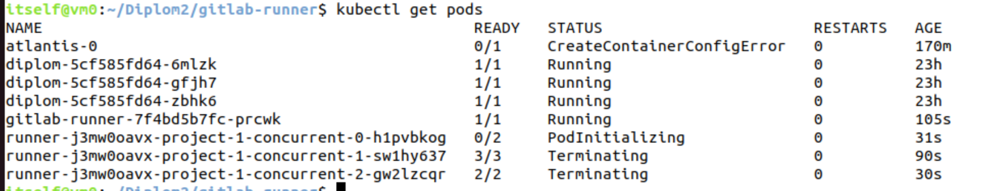 

- И на сайте

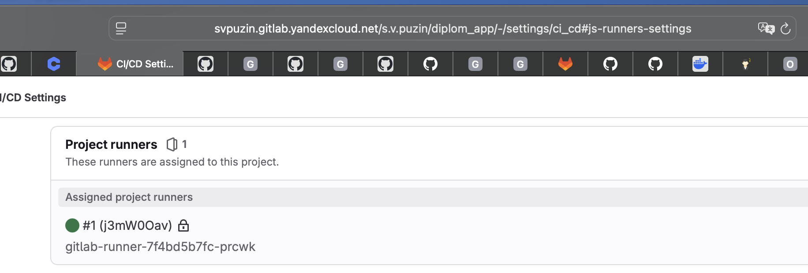

- Добавляем файл в репозиторий и вносим несколько правок через пайплайн-редактор.
После этого запускаем пайплайн и получаем результат, подтверждающий, что изменения успешно обработаны системой CI/CD.

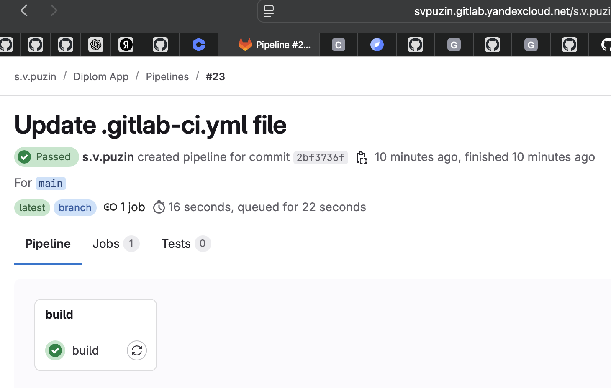

- Проверяем образы приложения в Container Registry, чтобы убедиться, что они успешно загружены и доступны.
Это позволяет подтвердить, что процесс сборки и загрузки завершён корректно и образы готовы к развертыванию.

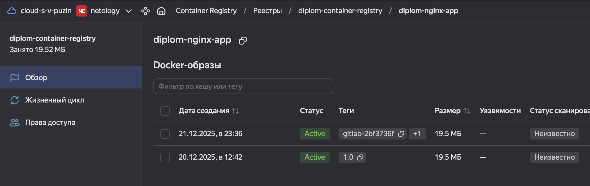

- 

и еще просьба,,,,,, в данный момент сильно напреженный период на работе ((((( прям очень (( если есть возможность и выполненного хватает да зачета диплома то Вы меня очень сильно порадуете )) оформлением как пологается позже обязательно займусь для потомков